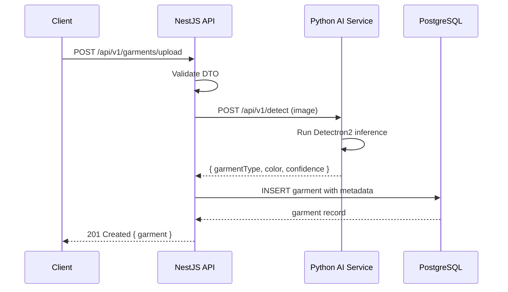

# Documentation Prompt — Closet Inteligente Digital

> **Purpose:** Standardized approach for generating, updating, and validating all documentation across the CID platform. Use this prompt when creating new documentation files or updating existing ones.

---

## 1. Documentation Types and Locations

| Documentation Type | Location | Format | Audience |
|---|---|---|---|
| **Memory System Files** | `project-memory/` | Markdown | AI agents + human contributors |
| **Architecture Decision Records** | `project-memory/decisions/` | Markdown (ADR template) | Architecture team |
| **Component Specifications** | `project-memory/components/` | Markdown | Developers maintaining the component |
| **API Documentation** | `project-memory/api/` | Markdown + OpenAPI | Frontend + external integrators |
| **Data Schemas** | `project-memory/schemas/` | JSON Schema + Markdown | All developers |
| **AI Model Cards** | `project-memory/ai-models/` | Markdown | AI/ML team |
| **Infrastructure Docs** | `project-memory/infrastructure/` | Markdown | DevOps team |
| **Guides & Workflows** | `project-memory/guides/` | Markdown | Onboarding contributors |
| **UI/UX Specifications** | `project-memory/ui-ux/` | Markdown + Figma links | Frontend team |
| **Code Comments** | In source files | TSDoc/JSDoc/Python docstrings | Developers reading the code |
| **README** | `./README.md` per package | Markdown | Users of that package |
| **Changelog** | `project-memory/CHANGELOG.md` | Markdown (Keep a Changelog) | All stakeholders |
| **PR / Commit Messages** | GitHub | Markdown | Code reviewers |

---

## 2. Documentation Structure Templates

### 2.1 Component Specification Template
```markdown
# <Component Name> — Closet Inteligente Digital

> **Component ID:** <FE-XX | BE-XX | AI-XX | 3D-XX | INF-XX>  
> **Status:** DRAFT | REVIEW | ACTIVE | DEPRECATED  
> **Owner:** <team or person>  
> **Last Updated:** YYYY-MM-DD

---

## 1. Overview

<1-2 paragraphs describing what this component does, its purpose, and its place in the system>

---

## 2. Responsibilities

<bullet list of what this component is responsible for>

### In Scope
- <responsibility 1>
- <responsibility 2>
- <responsibility 3>

### Out of Scope
- <explicitly not responsible for>
- <explicitly not responsible for>

---

## 3. Dependencies

### Depends On
| Component | Dependency Type | Notes |
|---|---|---|
| <component> | Runtime | <description of the dependency> |
| <component> | Build-time | <description> |

### Used By
| Component | Usage Type | Notes |
|---|---|---|
| <component> | API consumer | <description> |
| <component> | Event consumer | <description> |

---

## 4. API / Interface

### Exported Functions / Methods
```typescript
// For TypeScript components
function findAll(params: FindAllParams): Promise<PaginatedResult<IGarment>>;
function findOne(id: string): Promise<IGarment>;
function create(dto: CreateGarmentDto, userId: string): Promise<IGarment>;
```

### Events Emitted
| Event Name | Payload | Trigger |
|---|---|---|
| `garment:created` | `{ id, userId, garmentType }` | After garment creation |
| `garment:updated` | `{ id, userId, changes }` | After garment update |

### Events Consumed
| Event Name | Action Taken |
|---|---|
| `ai:detection-complete` | Update garment AI status |
| `sync:conflict` | Log conflict, notify user |

---

## 5. Configuration

### Environment Variables
| Variable | Required | Default | Description |
|---|---|---|---|
| `CID_<VAR>` | Yes | — | <description> |
| `CID_<VAR>` | No | `default` | <description> |

### Feature Flags
| Flag | Default | Description |
|---|---|---|
| `flag_name` | `false` | <description> |

---

## 6. Error States

| Condition | Error | Handling |
|---|---|---|
| <error condition> | <error type> | <how the system responds> |
| <error condition> | <error type> | <how the system responds> |

---

## 7. Performance Characteristics

| Metric | Target | Measurement |
|---|---|---|
| <metric> | <target> | <how to measure> |
| <metric> | <target> | <how to measure> |

---

## 8. Testing Strategy

| Test Type | Focus | Location |
|---|---|---|
| Unit | <what unit tests cover> | `<path>` |
| Integration | <what integration tests cover> | `<path>` |
| E2E | <what E2E tests cover> | `<path>` |

---

## 9. Related ADRs

| ADR | Title | Relevance |
|---|---|---|
| ADR-<NNN> | <title> | <why this ADR is relevant> |

---

## 10. Change History

| Date | Change | Author |
|---|---|---|
| YYYY-MM-DD | Initial draft | <agent-id> |
| YYYY-MM-DD | <description of update> | <agent-id> |
```

### 2.2 API Documentation Template (REST Endpoint)
```markdown
### `METHOD /api/v1/<resource>`

**Auth:** Required | Optional | None  
**Rate Limit:** <number> requests per <window>  
**Content-Type:** `application/json` (or multipart/form-data for uploads)

#### Description
<what this endpoint does, when to use it, and any important notes>

#### Request Headers
| Header | Required | Description |
|---|---|---|
| `Authorization` | Yes | `Bearer <token>` |
| `Idempotency-Key` | No | UUID for idempotent requests |

#### Query Parameters
| Parameter | Type | Required | Default | Description |
|---|---|---|---|---|
| `page` | integer | No | `1` | Page number (1-indexed) |
| `pageSize` | integer | No | `20` | Items per page (max 100) |
| `sortBy` | string | No | `createdAt` | Field to sort by |
| `order` | enum | No | `DESC` | Sort order (`ASC` or `DESC`) |
| `filter` | string | No | — | JSON-encoded filter object |

#### Request Body
```json
{
  "name": "string | required | Garment name (2-100 chars)",
  "garmentType": "enum | required | EGarmentType value",
  "brand": "string | optional | Brand name (max 100 chars)",
  "size": "string | optional | Size label (max 50 chars)",
  "color": "string | optional | Primary color name (max 100 chars)",
  "priceAmountCents": "integer | optional | Price in cents (minimum 0)",
  "priceCurrency": "string | optional | ISO 4217 currency code (default: COP)"
}
```

#### Response 200 (Success)
```json
{
  "data": {
    "id": "uuid",
    "name": "string",
    "garmentType": "enum",
    "imageUrl": "string (url)",
    "createdAt": "string (ISO 8601)"
  }
}
```

#### Response 201 (Created)
```json
{
  "data": {
    "id": "uuid",
    "name": "string",
    "garmentType": "enum",
    "createdAt": "string (ISO 8601)"
  }
}
```

#### Response 422 (Validation Error)
```json
{
  "success": false,
  "error": {
    "code": "VALIDATION_ERROR",
    "message": "Validation failed",
    "details": {
      "name": ["Name is required", "Name must be 2-100 characters"],
      "garmentType": ["Garment type must be a valid EGarmentType"]
    }
  }
}
```

#### Errors
| Status Code | Error Code | Description |
|---|---|---|
| `400` | `BAD_REQUEST` | Malformed request syntax |
| `401` | `UNAUTHORIZED` | Missing or invalid authentication |
| `403` | `FORBIDDEN` | Insufficient permissions |
| `404` | `NOT_FOUND` | Resource not found |
| `409` | `CONFLICT` | Resource already exists |
| `422` | `VALIDATION_ERROR` | Request body failed validation |
| `429` | `RATE_LIMIT_EXCEEDED` | Too many requests |
| `500` | `INTERNAL_ERROR` | Server error |

#### Example
```bash
curl -X POST https://api.closetinteligente.com/api/v1/garments \
  -H "Authorization: Bearer <token>" \
  -H "Content-Type: application/json" \
  -d '{
    "name": "Blue Cotton Shirt",
    "garmentType": "Top",
    "brand": "Zara",
    "size": "M",
    "color": "Blue"
  }'
```
```

### 2.3 API Documentation Template (WebSocket Event)
```markdown
### Event: `garment:created`

**Direction:** Server → Client  
**Auth:** Required (JWT in connection handshake)  
**Room:** `user:<userId>`

#### Description
Emitted when a new garment is created for the authenticated user.

#### Payload
```json
{
  "id": "uuid",
  "userId": "uuid",
  "name": "string",
  "garmentType": "enum",
  "imageUrl": "string",
  "createdAt": "string (ISO 8601)"
}
```

#### Client Handling
```typescript
socket.on('garment:created', (garment: IGarment) => {
  queryClient.invalidateQueries({ queryKey: ['garments'] });
});
```

#### Related Events
| Event | Relationship |
|---|---|
| `garment:updated` | Fired when garment is modified |
| `garment:deleted` | Fired when garment is removed |
```

### 2.4 AI Model Card Template
```markdown
# Model Card: <Model Name>

> **Model ID:** <unique identifier>  
> **Version:** <version>  
> **Date:** YYYY-MM-DD  
> **Author:** <agent-id or team>

---

## 1. Model Overview

- **Task:** <classification, detection, segmentation, embedding, etc.>
- **Architecture:** <Detectron2 Mask R-CNN, CLIP ViT-B/32, etc.>
- **Framework:** PyTorch <version>
- **Input:** <image dimensions, format, preprocessing>
- **Output:** <what the model returns, data format>
- **Inference Time:** <P50 / P95 / P99 on target hardware>

---

## 2. Training Data

- **Dataset:** <name and source>
- **Size:** <number of samples>
- **Split:** <train/val/test percentages>
- **Label Distribution:** <table of labels and counts>
- **Data Collection:** <how data was collected, annotated, and validated>

---

## 3. Performance Metrics

| Metric | Value | Notes |
|---|---|---|
| Accuracy | XX% | On test set |
| Precision | XX% | Macro average |
| Recall | XX% | Macro average |
| F1 Score | XX% | Macro average |
| mAP@0.5 | XX% | For detection models |
| mAP@0.5:0.95 | XX% | For detection models |
| Inference (CPU) | XXms | Intel Xeon @ 2.8GHz |
| Inference (GPU) | XXms | NVIDIA T4 |
| Model Size | XX MB | ONNX export |

---

## 4. Limitations & Biases

- <known limitation 1>
- <known limitation 2>
- <bias consideration 1>
- <bias consideration 2>

---

## 5. Usage

### Python API
```python
from models.garment_detector import GarmentDetector

detector = GarmentDetector(model_path="models/v1/detectron2_model.pth")
result = detector.detect(image_path="path/to/garment.jpg")
print(result.garment_type, result.confidence)
```

### HTTP API
```bash
curl -X POST https://ai.closetinteligente.com/api/v1/detect \
  -F "image=@garment.jpg"
```

---

## 6. Deployment Requirements

| Resource | Minimum | Recommended |
|---|---|---|
| RAM | 4 GB | 8 GB |
| GPU Memory | 4 GB (T4) | 8 GB (A10G) |
| Disk | 2 GB | 5 GB |
| CUDA | 11.8+ | 12.0+ |

---

## 7. Version History

| Version | Date | Changes |
|---|---|---|
| v1.0.0 | YYYY-MM-DD | Initial release |
| v1.1.0 | YYYY-MM-DD | Added fabric type classification |
```

### 2.5 Guide / Workflow Template
```markdown
# <Guide Title> — Closet Inteligente Digital

> **Audience:** <who this guide is for>  
> **Prerequisites:** <what the reader should know/have before starting>  
> **Last Updated:** YYYY-MM-DD

---

## Overview

<1-2 paragraphs describing what this guide covers and why it's useful>

---

## Step 1: <Step Title>

<instructions for step 1>

```bash
<command if applicable>
```

---

## Step 2: <Step Title>

<instructions for step 2>

---

## Troubleshooting

| Problem | Solution |
|---|---|
| <common problem> | <how to fix it> |
| <common problem> | <how to fix it> |

---

## Related Resources

- <link to related doc>
- <link to related ADR>
```

### 2.6 README Template (Package-level)
```markdown
# <Package Name>

> **Package:** `<package-name>`  
> **Version:** <version>  
> **License:** MIT

---

## Description

<1-2 paragraphs describing what this package does>

## Installation

```bash
pnpm add <package-name>
```

## Usage

```typescript
import { something } from '<package-name>';

// Example usage
const result = something(input);
```

## API

### `functionName(params: Type): ReturnType`

<description of the function>

## Development

```bash
pnpm build
pnpm test
pnpm lint
```

## Dependencies

- <dependency> — <purpose>
```

---

## 3. Required Sections per Document Type

### 3.1 Memory System Documents

| Document | Required Sections |
|---|---|
| **PROJECT_STATUS.md** | Header (status, phase, progress), Overall Progress Summary, Component Status Table (per layer), Known Issues, Next Milestones, Risk Register, Blockers, Decision Log Pointer |
| **ROADMAP.md** | Header (phase, timeline), Per-Phase Breakdown (weeks, tasks, hours, success criteria, risk mitigation), Dependency Graph, Overall Summary, Key Dependencies |
| **CHANGELOG.md** | Header (format, versioning), Unreleased section, Per-version entries (Added, Changed, Deprecated, Removed, Fixed, Security) |
| **CONTRIBUTING.md** | Agent Guidelines, Memory System Rules, PR Standards, File Modification Rules, Documentation Requirements, Testing Requirements, Code Review Process, Commit Message Format, Branch Naming, Code Style |
| **agents.md** | Agent identity format, mandatory reading list, memory update rules, scope limits, escalation procedures |

### 3.2 Architecture Documents

| Document | Required Sections |
|---|---|
| **ADR** | Context, Decision, Consequences (Positive/Negative/Neutral), Alternatives Considered, References, Status History |
| **Component Specification** | Overview, Responsibilities, Dependencies, API/Interface, Configuration, Error States, Performance, Testing Strategy, Related ADRs, Change History |
| **Architecture Overview** | High-level diagram, Layer descriptions, Data flows, Component interaction diagrams, Deployment architecture |
| **Data Model** | ER diagram, Table definitions (all columns with types, constraints, defaults, descriptions), Indexes, Foreign keys, Enums, Relationships summary |

### 3.3 Technical Documents

| Document | Required Sections |
|---|---|
| **API Endpoint Docs** | Method + Path, Auth, Rate Limit, Description, Request Headers, Query Parameters, Request Body (with field descriptions), Response examples (200, 201, 4xx, 5xx), Errors table, curl example |
| **WebSocket Event Docs** | Event name, Direction, Auth, Room, Description, Payload, Client handling example, Related events |
| **AI Model Card** | Model Overview, Training Data, Performance Metrics, Limitations/Biases, Usage (Python + HTTP), Deployment Requirements, Version History |
| **Infrastructure Doc** | Environment overview, Service configuration, Deployment steps, Monitoring setup, Backup strategy, Rollback procedure |

### 3.4 User-Facing Documents

| Document | Required Sections |
|---|---|
| **README** | Project description, Setup instructions, Usage examples, Configuration, Contributing, License |
| **Guide** | Audience, Prerequisites, Overview, Step-by-step instructions, Troubleshooting, Related resources |
| **Changelog** | Version entries with date, Categorized changes (Added/Changed/Fixed/Removed/Security) |

---

## 4. Documentation Quality Standards

### 4.1 Writing Style
- **Active voice:** "The service creates a garment" not "A garment is created by the service"
- **Imperative mood:** "Create a garment" not "Creating a garment" or "Creates a garment"
- **Present tense:** "This endpoint returns" not "This endpoint will return"
- **Be specific:** Use concrete examples, not abstractions
- **Be concise:** One idea per paragraph, no filler text
- **Be accurate:** Verify code examples actually work before committing

### 4.2 Markdown Conventions
- `#` Title (one per document)
- `##` Major sections
- `###` Subsections
- `####` Detailed entries
- `inline code` for code, variables, file paths, and commands
- ```fenced code blocks``` with language identifier for multi-line code
- `**bold**` for emphasis and UI labels
- `*italic*` for introducing new terms
- `---` for horizontal rules between major sections
- Tables for structured data (columns: left-aligned headers, dashes, rows)
- Lists for unordered items (use `-` not `*`)
- Numbered lists for sequential steps
- `> blockquote` for notes, warnings, and tips
- `[link text](url)` for hyperlinks
- `[TODO]` for incomplete sections (must be resolved before PR)

### 4.3 Code Examples
- Every code example must be tested and runnable
- Use realistic data, not placeholder names like "foo" or "bar"
- Show both request and response for API examples
- Include error handling examples for robustness
- Use environment variables from `.env.example` (never hardcode secrets)
- Use `...` for truncation, not for hiding important details

### 4.4 Diagrams
- Use **Mermaid** for sequence diagrams, flow charts, and entity relationships
- Use **ASCII art** for simple architecture diagrams (in markdown files)
- Use **PlantUML** for complex UML diagrams (stored in `docs/diagrams/`)
- Every diagram must have a descriptive caption

**Mermaid example:**


### 4.5 Notes, Warnings, and Tips
```markdown
> **Note:** This endpoint is rate-limited to 10 requests per minute.

> **Warning:** Running this migration will lock the `garments` table. Schedule during maintenance window.

> **Tip:** Use the `--dry-run` flag to preview changes before executing.
```

---

## 5. Update Validation Checklist

### 5.1 General Documentation Checklist
- [ ] All required sections for the document type are present
- [ ] Title is descriptive and uses `#` (single h1 per document)
- [ ] Document follows the appropriate template structure
- [ ] Terminology is consistent with the rest of the project (e.g., "garment" not "clothing item")
- [ ] Code examples are accurate and tested
- [ ] Links are valid (not broken)
- [ ] No placeholder text ("TODO", "TBD", "FIXME") without a tracking issue
- [ ] Spelling and grammar are correct
- [ ] Dates are in YYYY-MM-DD format
- [ ] Markdown renders correctly (no missing spaces, no broken formatting)
- [ ] Tables have proper alignment (dashes under headers)
- [ ] Code blocks have language identifiers
- [ ] No hardcoded secrets, tokens, or API keys

### 5.2 Memory File Update Checklist
- [ ] PROJECT_STATUS.md: Component status reflects current reality
- [ ] CHANGELOG.md: New entry under [Unreleased] with date and description
- [ ] CHANGELOG.md: Entry uses correct category (Added/Changed/Fixed/Removed/Security)
- [ ] ADR: Number is sequential (no gaps), status is correct
- [ ] Component spec: Updated with any interface changes
- [ ] API docs: Updated with any endpoint changes (request/response/errors)
- [ ] Session log: Written to AGENT-LOGS/ with date, agent ID, and activity

### 5.3 API Documentation Checklist
- [ ] Method and path are correct
- [ ] Auth requirements are accurate
- [ ] All request parameters documented (path, query, body, headers)
- [ ] All possible response codes documented (200, 201, 4xx, 5xx)
- [ ] Response body structure matches actual API response
- [ ] Error responses include code and message format
- [ ] Example curl command works
- [ ] WebSocket events include direction, payload, and room

### 5.4 AI Model Card Checklist
- [ ] Model architecture and framework are documented
- [ ] Training data source, size, and distribution documented
- [ ] Performance metrics (accuracy, precision, recall, F1, inference time)
- [ ] Limitations and biases are acknowledged
- [ ] Usage examples (Python + HTTP) are complete and correct
- [ ] Deployment requirements (RAM, GPU, disk) are specified
- [ ] Version history is maintained

---

## 6. Documentation Review Process

### 6.1 Self-Review
Before submitting documentation for review:
1. Read the document as if you were a new contributor
2. Check for gaps: Is anything missing that a reader would need?
3. Verify all code examples by running them
4. Check all links and references
5. Run a spell checker

### 6.2 Peer Review Checklist
- [ ] Is the document accurate? (Does it match the actual behavior?)
- [ ] Is the document complete? (Are all required sections present?)
- [ ] Is the document clear? (Would a new team member understand it?)
- [ ] Is the document consistent? (Does it match the tone and style of similar docs?)
- [ ] Are diagrams helpful and accurate?
- [ ] Are code examples correct and complete?
- [ ] Are edge cases and error states documented?

### 6.3 Documentation Debt Tracking
If documentation is incomplete or outdated:
1. Add a `[TODO]` tag at the relevant section
2. Create a GitHub Issue for documentation debt
3. Reference the issue in the TODO tag
4. Prioritize documentation debt in the next sprint

---

## 7. Automated Documentation

### 7.1 API Documentation Generation
```bash
# Generate Swagger/OpenAPI docs (NestJS)
cd apps/api
npm run build
npm run docs:generate
# Output: apps/api/docs/openapi.json

# Verify OpenAPI spec is valid
npx @apidevtools/swagger-cli validate docs/openapi.json
```

### 7.2 TypeScript Type Documentation
```bash
# Generate TypeDoc for shared packages
cd packages/shared
npm run docs:generate
# Output: packages/shared/docs/
```

### 7.3 Python Documentation
```bash
# Generate Sphinx docs for AI service
cd services/ai
sphinx-build docs/source docs/build
```

---

## 8. Documentation File Naming

| Document Type | Naming Convention | Example |
|---|---|---|
| ADR | `adr-<NNN>-<kebab-case-title>.md` | `adr-003-use-supabase-auth.md` |
| Component Spec | `<kebab-case-name>.md` | `garment-upload-service.md` |
| API Endpoints | `rest-endpoints.md` | `rest-endpoints.md` |
| WebSocket Events | `websocket-events.md` | `websocket-events.md` |
| AI Model Card | `<kebab-case-model-name>.md` | `garment-segmentation.md` |
| Schema | `<entity>.schema.json` | `garment.schema.json` |
| Guide | `<kebab-case-guide-name>.md` | `local-dev-setup.md` |
| Session Log | `session-YYYY-MM-DD--<agent-id>.md` | `session-2026-05-25--agent-alpha.md` |
| PR/Commit | Per CONTRIBUTING.md | `feat(garment): add upload endpoint` |
